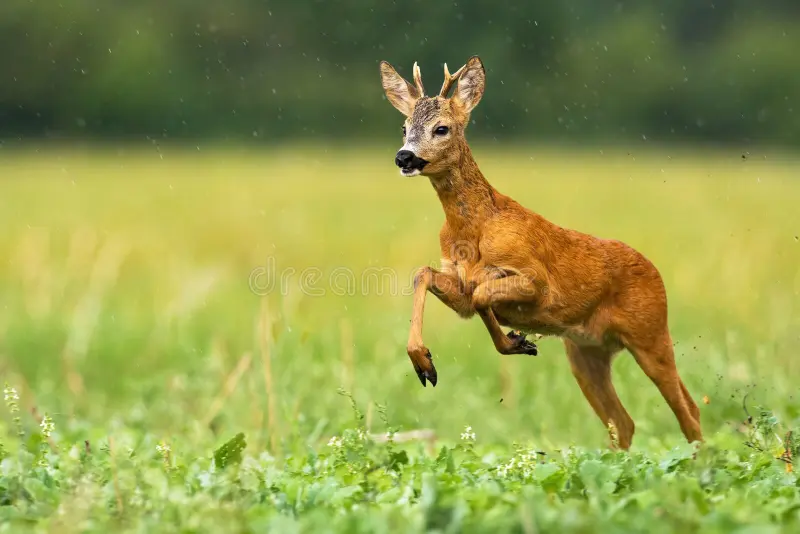

```{r setup, include=FALSE}
knitr::opts_chunk$set(echo = TRUE)
packages_needed <- c("ggplot2",
                     "patchwork",
                     "MuMIn", 
                     "olsrr"
                     )
pk_to_install <- packages_needed [!( packages_needed %in% rownames(installed.packages())  )]
if(length(pk_to_install)>0 ){
  install.packages(pk_to_install,repos="http://cran.r-project.org")
}
#lapply(packages_needed, require, character.only = TRUE)
library(ggplot2)
library(patchwork)
library(MuMIn)
library(olsrr)
```

## Roe Deer Habitat Selection



```{r deer upload}
deer<-read.csv("Drive_counts.csv")
```

## Investigating the Colinearity

You can also embed plots, for example:

```{r colinear check}
pairs(deer[,3:7], lower.panel = NULL)
```

```{R Corr Matrix}
correlation.matrix <- cor(deer[,3:7])
correlation.matrix
```

```{r remove nas, include=FALSE}
options(na.action = "na.fail")
```

## The Model

```{r Model run}
model_deer1 <- lm(Density ~ Vegetated.Surface + Buffered.zone + Wooded_Zone + Wooded_percentage + Weighted_surface..ha., data=deer)
anova (model_deer1)
```

```{r colinearity 2}
performance::check_collinearity(model_deer1)
```

```{r plots}
olsrr::ols_plot_added_variable(model_deer1)
```

```{r model fit check, fig.height=7, fig.width=10}
performance::check_model(model_deer1)
```

```{r AIC}
options(na.action = "na.fail")
dredge_deer<-dredge(model_deer1)
dredge_deer

```

```{r first subset}
subset(dredge_deer, delta <2)
```

```{r weighting}
sw(dredge_deer)
```

```{r summary}
summary(model.avg(dredge_deer, subset = delta < 2))
```

```{r last plot}
SAp<- ggplot(deer, aes( Vegetated.Surface, Density, colour = Wooded_percentage)) + 
  geom_point(size=3) +
  geom_smooth(method="lm")
SAp
```
